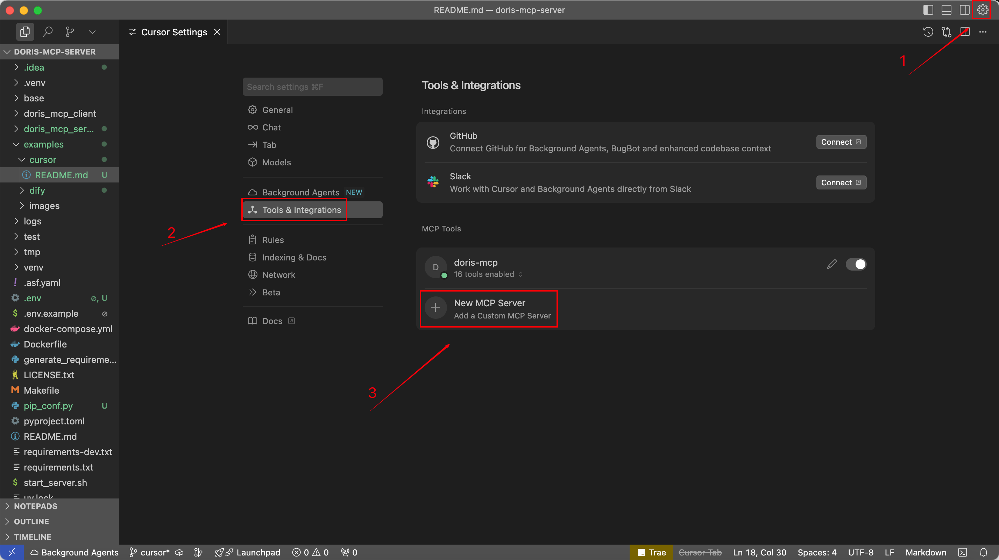
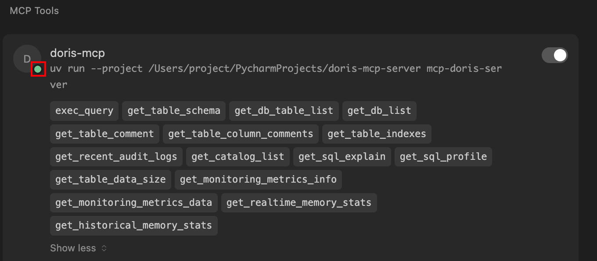
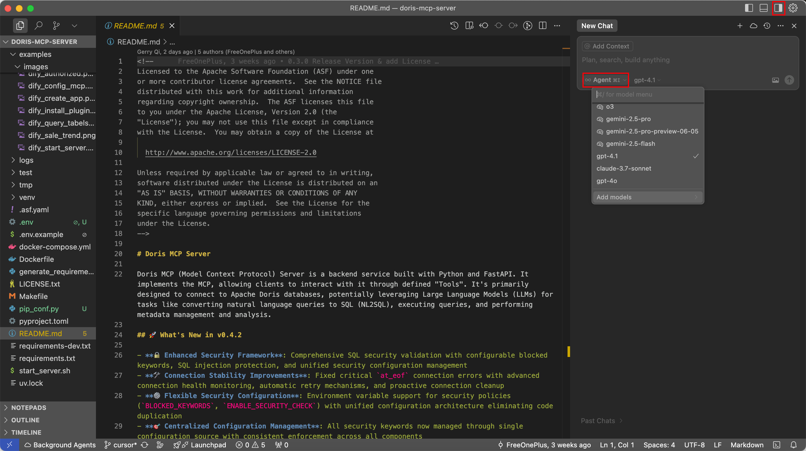
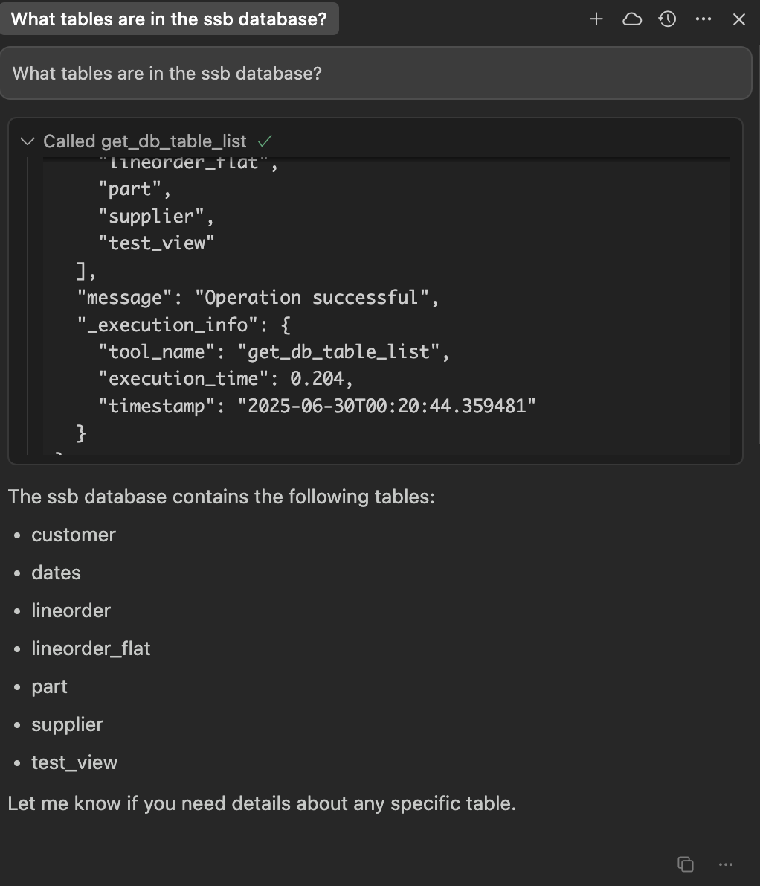
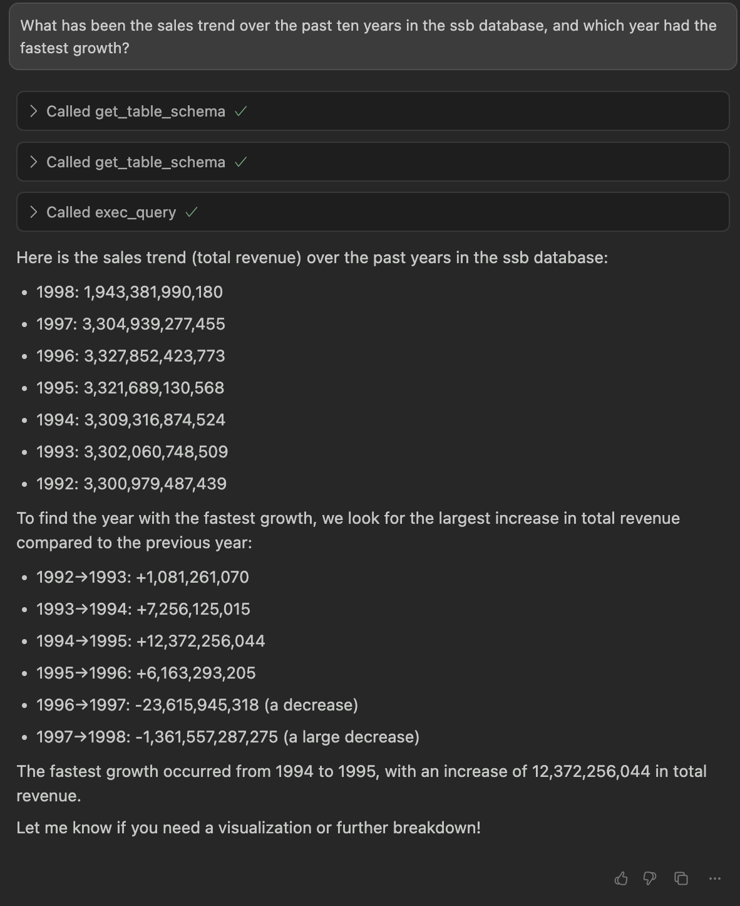

<!--
Licensed to the Apache Software Foundation (ASF) under one
or more contributor license agreements.  See the NOTICE file
distributed with this work for additional information
regarding copyright ownership.  The ASF licenses this file
to you under the Apache License, Version 2.0 (the
"License"); you may not use this file except in compliance
with the License.  You may obtain a copy of the License at

  http://www.apache.org/licenses/LICENSE-2.0

Unless required by applicable law or agreed to in writing,
software distributed under the License is distributed on an
"AS IS" BASIS, WITHOUT WARRANTIES OR CONDITIONS OF ANY
KIND, either express or implied.  See the License for the
specific language governing permissions and limitations
under the License.
-->


# Cursor Example: Integrating Doris MCP Server

This guide provides step-by-step instructions on how to integrate the `doris-mcp-server` with the [Cursor](https://cursor.sh/) IDE. This integration allows you to interact with your Apache Doris database using natural language queries directly within Cursor's AI chat.

## Table of Contents

* [Prerequisites](#prerequisites)
* [Step 1: Set Up the Project](#step-1-set-up-the-project)
* [Step 2: Configure the MCP Server in Cursor](#step-2-configure-the-mcp-server-in-cursor)
* [Step 3: Verify the Integration](#step-3-verify-the-integration)
* [Step 4: Query Your Database](#step-4-query-your-database)

  * [Example 1: List Tables](#example-1-list-tables)
  * [Example 2: Analyze Sales Trends](#example-2-analyze-sales-trends)

---

### Prerequisites

Before you begin, ensure you have the following installed and configured:

* The **Cursor** IDE
* **Git** for cloning the repository
* Access to an **Apache Doris** cluster (FE host, port, username, and password)
* **uv**, a fast Python package installer and runner

You can install `uv` with one of the following commands:

```bash
# For macOS (recommended)
brew install uv

# For other systems using pipx
pipx install uv
```

---

### Step 1: Set Up the Project

First, clone the `doris-mcp-server` repository to your local machine:

```bash
git clone https://github.com/apache/doris-mcp-server.git

cd doris-mcp-server
```

The necessary dependencies are listed in `requirements.txt` and will be managed automatically by `uv` in the next step.

---

### Step 2: Configure the MCP Server in Cursor

1. Open the cloned `doris-mcp-server` directory in Cursor.
2. Click the ⚙️ icon (top-right), then go to **Tools & Integrations**.
   
3. Click **Add a custom MCP Server**.
4. Paste the following JSON configuration:

```json
{
  "mcpServers": {
    "doris-mcp": {
      "command": "uv",
      "args": [
        "run",
        "--project",
        "/path/to/your/doris-mcp-server",
        "mcp-doris-server"
      ],  
      "env": {
        "DB_HOST": "your_doris_fe_host",
        "DB_PORT": "9030",
        "DB_USER": "your_username",
        "DB_PASSWORD": "your_password",
        "DB_DATABASE": "ssb"
      }
    }
  }
}
```

> ⚠️ **Important:**
>
> * Replace `"/path/to/your/doris-mcp-server"` with the **absolute path** to your local project directory.
> * Fill in your actual Doris FE host, username, password, and database name.

---

### Step 3: Verify the Integration

Once saved, go back to the **Settings** panel. If everything is configured correctly, you’ll see a green status dot next to `doris-mcp-server`, along with available tools like `exec_query`.



---

### Step 4: Query Your Database

You can now chat with Cursor Agent to run SQL queries against your Doris database.

1. Open the chat panel using `Cmd + K` (macOS) or `Ctrl + K` (Windows/Linux), or click the chat icon in the top-right.
2. Switch to **Agent Mode**.
3. Start asking questions using natural language.



---

#### Example 1: List Tables

> **Prompt:** What tables are in the `ssb` database?

The agent will call the `get_db_table_list` tool and return the results.



---

#### Example 2: Analyze Sales Trends

> **Prompt:** What has been the sales trend over the past ten years in the `ssb` database, and which year had the fastest growth?

The agent will generate an appropriate SQL query, send it to the MCP server, and interpret the results to give you growth trends and highlights.


