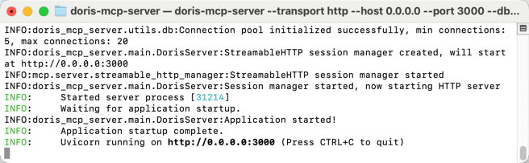
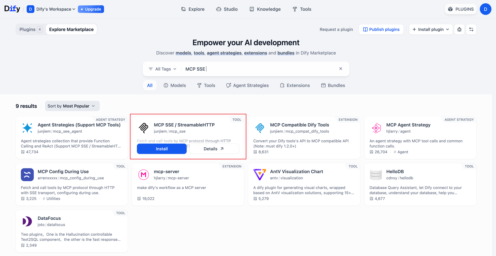
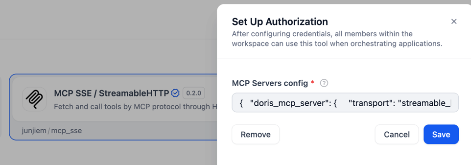
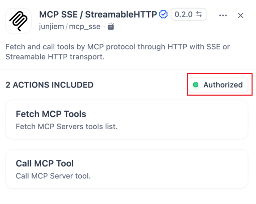
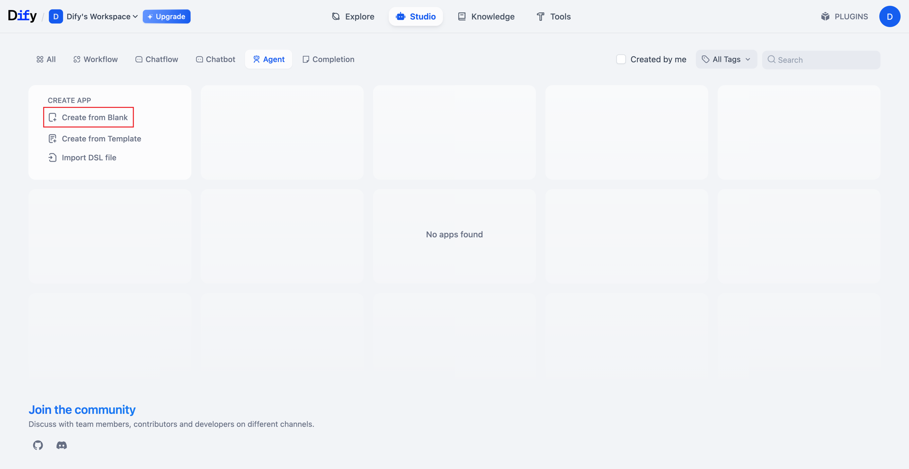
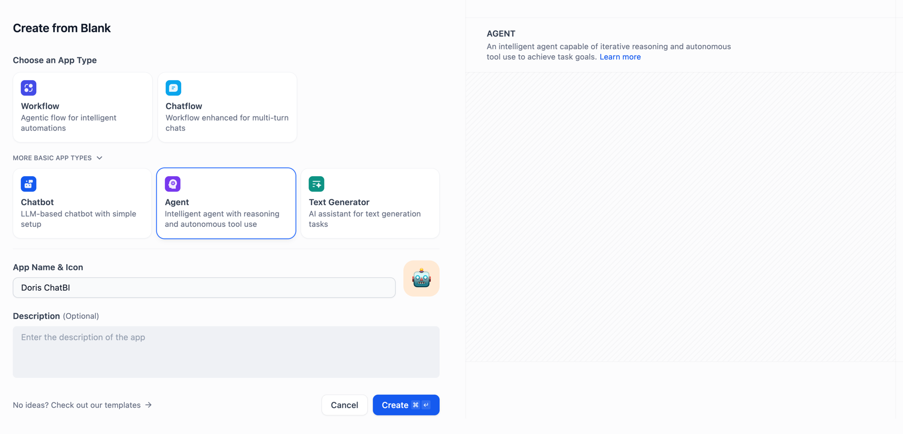
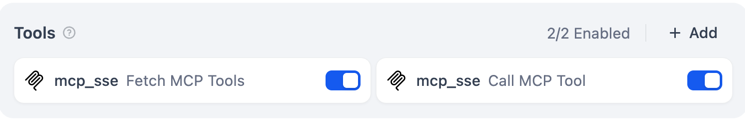
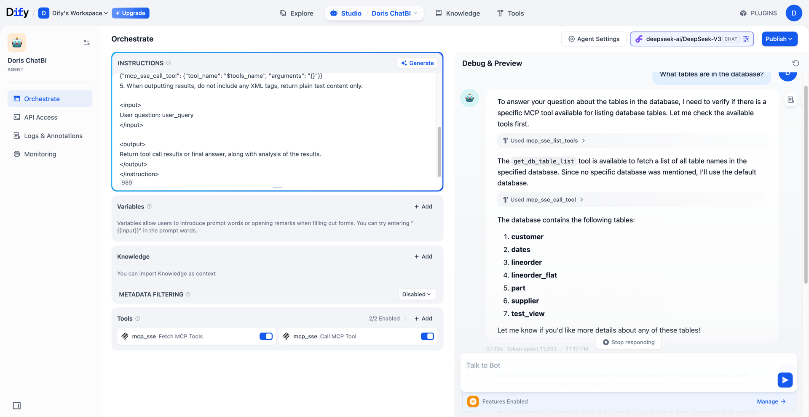
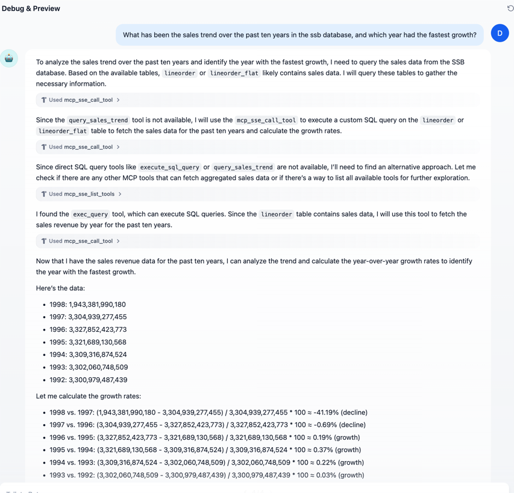

<!--
Licensed to the Apache Software Foundation (ASF) under one
or more contributor license agreements.  See the NOTICE file
distributed with this work for additional information
regarding copyright ownership.  The ASF licenses this file
to you under the Apache License, Version 2.0 (the
"License"); you may not use this file except in compliance
with the License.  You may obtain a copy of the License at

  http://www.apache.org/licenses/LICENSE-2.0

Unless required by applicable law or agreed to in writing,
software distributed under the License is distributed on an
"AS IS" BASIS, WITHOUT WARRANTIES OR CONDITIONS OF ANY
KIND, either express or implied.  See the License for the
specific language governing permissions and limitations
under the License.
-->


# Dify Example: Integrating Doris MCP Server

This document demonstrates how to integrate and use `doris-mcp-server` in Dify to perform Doris SQL calls via MCP.

## Table of Contents

- [Prerequisites](#prerequisites)
- [Installation & Configuration](#installation--configuration)
- [Starting the MCP Server](#starting-the-mcp-server)
- [Ngrok Tunnel (Optional)](#ngrok-tunnel-optional)
- [Installing & Configuring the Plugin in Dify](#installing--configuring-the-plugin-in-dify)
- [Creating a Dify App](#creating-a-dify-app)
- [Adding MCP Tools](#adding-mcp-tools)
- [Example Calls](#example-calls)

---

## Prerequisites

1. Clone the repository:
   ```bash
   git clone https://github.com/apache/doris-mcp-server.git
   
   cd doris-mcp-server
    ```

2. Install the latest Python package and copy the environment template:

   ```bash
   pip install mcp-doris-server
   
   cp .env.example .env
   
   vim .env
   ```

   Fill in your Doris FE connection settings in `.env`:

   ```env
   DORIS_HOST=localhost
   DORIS_PORT=9030
   DORIS_USER=root
   DORIS_PASSWORD=
   DORIS_DATABASE=information_schema

   DORIS_FE_HTTP_PORT=8030

   # Optional: custom BE host list
   DORIS_BE_HOSTS=
   ```


## Starting the MCP Server

Run the startup script:

```bash
./start_server.sh
```

If successful, you will see logs like this:


---

## Ngrok Tunnel (Optional)

If your Dify deployment requires a public endpoint, use [ngrok](https://ngrok.com):

```bash
ngrok http http://localhost:3000
```

Use the generated public URL in subsequent steps.


---

## Installing & Configuring the Plugin in Dify

1. In the Dify console, go to **Plugin Marketplace**, search for and install **MCP‑SSE / StreamableHTTP**:
   

2. After installation, click **Configure** and set the URL to your public or local address (e.g., `https://abc123.ngrok.io/mcp`):

   ```json
   {
     "doris_mcp_server": {
       "transport": "streamable_http",
       "url": "https://<your-domain>/mcp"
     }
   }
   ```

   

3. Click **Save**. If configured correctly, you will see a green **Authorized** indicator:

   

---


## Creating a Dify App

1. In the Dify console, click **New App** → **Blank App**.



2. Select **Agent** as the template, set **App Name** (e.g., `Doris ChatBI`).



---

## Instructions & Tool Configuration

### Instruction Block

Paste the following into the **Instruction** field:

```
<instruction>
Use MCP tools to complete tasks as much as possible. Carefully read the annotations, method names, and parameter descriptions of each tool. Please follow these steps:

1. Analyze the user's question and match the most appropriate tool.
2. Use tool names and parameters exactly as defined; do not invent new ones.
3. Pass parameters in the required JSON format.
4. When calling tools, use:
   {"mcp_sse_call_tool": {"tool_name": "<tool_name>", "arguments": "{}"}}
5. Output plain text only—no XML tags.

<input>
User question: user_query
</input>

<output>
Return tool results or a final answer, including analysis.
</output>
</instruction>
```

### Adding MCP Tools

In the **Tools** pane, click **Add** twice to add two entries both named `mcp_sse` (they will inherit transport and URL from the plugin):




---

## Example Calls

### List Tables in Database

* **User**: What tables are in the database?
* **Result**: Dify will call the MCP tool to run `SHOW TABLES` and return the list.
  

### Sales Trend Over Ten Years

* **User**: What has been the sales trend over the past ten years in the ssb database, and which year had the fastest growth?
* **Result**: The tool will execute the SQL, calculate growth rates, and return a trend chart or table.
  


````md
<!--
Licensed to the Apache Software Foundation (ASF) under one
or more contributor license agreements.  See the NOTICE file
... (license omitted for brevity)
-->

# Dify Example: Integrating Doris MCP Server

This document demonstrates how to integrate and use the `doris-mcp-server` in Dify to perform Doris SQL calls via MCP.

## Table of Contents

- [Prerequisites](#prerequisites)
- [Installation & Configuration](#installation--configuration)
- [Starting the MCP Server](#starting-the-mcp-server)
- [Ngrok Tunnel (Optional)](#ngrok-tunnel-optional)
- [Installing & Configuring the Plugin](#installing--configuring-the-plugin)
- [Creating a Dify App](#creating-a-dify-app)
- [Instructions & Tool Configuration](#instructions--tool-configuration)
- [Example Calls](#example-calls)

---

## Prerequisites

1. Clone the repository:
   ```bash
   git clone https://github.com/apache/doris-mcp-server.git
   cd doris-mcp-server
````

2. Install the Python package and prepare the environment file:

   ```bash
   pip install mcp-doris-server
   cp .env.example .env
   vim .env
   ```

3. In `.env`, set your Doris front-end connection:

   ```env
   DORIS_HOST=localhost
   DORIS_PORT=9030
   DORIS_USER=root
   DORIS_PASSWORD=
   DORIS_DATABASE=information_schema
   DORIS_FE_HTTP_PORT=8030
   # Optional: custom BE host list
   DORIS_BE_HOSTS=
   ```

---

## Installation & Configuration

1. Install the MCP server package:

   ```bash
   pip install mcp-doris-server
   ```
2. Copy and edit the environment template as shown above.

---

## Starting the MCP Server

Run the startup script:

```bash
./start_server.sh
```

If successful, you will see logs like this:


---

## Ngrok Tunnel (Optional)

If your Dify deployment requires a public endpoint, use [ngrok](https://ngrok.com/):

```bash
ngrok http http://localhost:3000
```

Use the generated URL in the plugin configuration.


---

## Installing & Configuring the Plugin

1. In the Dify console, go to **Plugin Marketplace**, search for **MCP‑SSE / StreamableHTTP**, and install it.


2. Click **Configure**, and set the URL (e.g., `https://<your-domain>/mcp`):

```json
{
  "doris_mcp_server": {
    "transport": "streamable_http",
    "url": "https://<your-domain>/mcp"
  }
}
```


3. Click **Save**. A green **Authorized** indicator should appear:


---

## Creating a Dify App

1. In the Dify console, click **New App** → **Blank App**.


2. Select **Agent** as the template, set **App Name** (e.g., `Doris ChatBI`).


---

## Instructions & Tool Configuration

### Instruction Block

Paste the following into the **Instruction** field:

```
<instruction>
Use MCP tools to complete tasks as much as possible. Carefully read the annotations, method names, and parameter descriptions of each tool. Please follow these steps:

1. Analyze the user's question and match the most appropriate tool.
2. Use tool names and parameters exactly as defined; do not invent new ones.
3. Pass parameters in the required JSON format.
4. When calling tools, use:
   {"mcp_sse_call_tool": {"tool_name": "<tool_name>", "arguments": "{}"}}
5. Output plain text only—no XML tags.

<input>
User question: user_query
</input>

<output>
Return tool results or a final answer, including analysis.
</output>
</instruction>
```

### Adding MCP Tools

In the **Tools** pane, click **Add** twice to add two entries both named `mcp_sse` (they will inherit transport and URL from the plugin):


---

## Example Calls

### List Tables in Database

* **User**: What tables are in the database?
* **Result**: Dify calls the MCP tool to run `SHOW TABLES` and returns the list.


### Sales Trend Over Ten Years

* **User**: What has been the sales trend in the `ssb` database over the past ten years, and which year saw the fastest growth?
* **Result**: The tool executes SQL, computes growth rates, and returns a chart or table.


